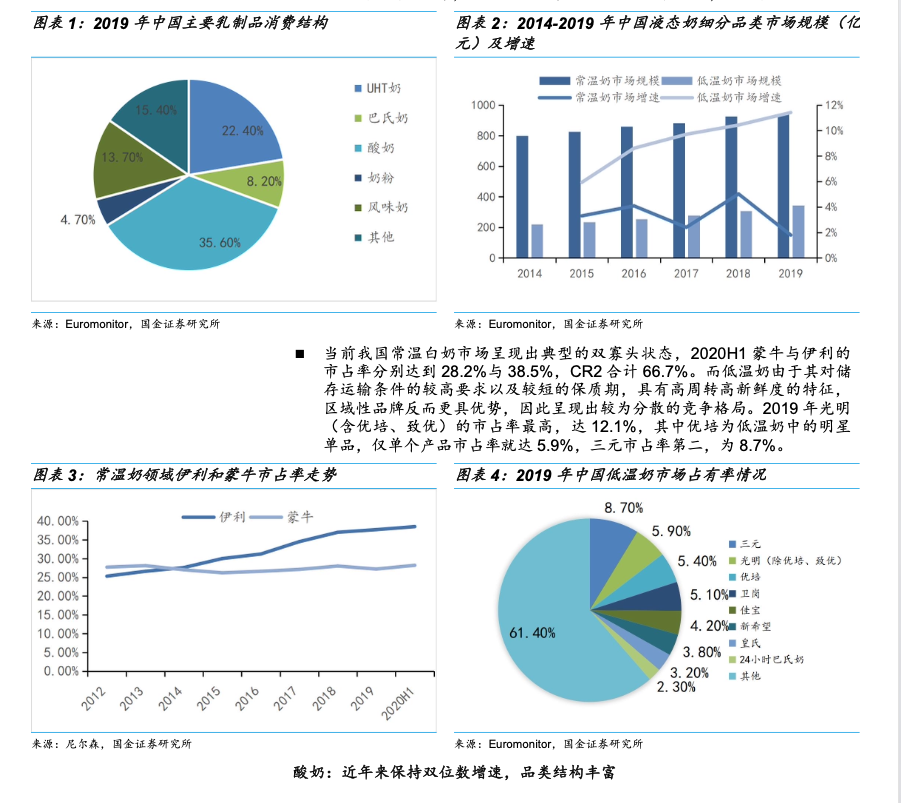

## 项目背景

在信息爆炸的时代，人们获取知识的方式不再局限于纯文本，大量的信息存在于图文混排的文档、网页、报告甚至图片库中。传统的问答系统多基于纯文本，难以有效处理需要结合图像内容进行推理的复杂问题。例如，用户可能想知道“这张图片里，左边那个设备的功能是什么？”或“根据图表显示，产品A的销售额在哪个季度开始下降？”。要回答这类问题，模型不仅需要理解自然语言问题，还需要“看懂”图像，并将两者关联起来进行推理。

检索增强生成 (Retrieval-Augmented Generation, RAG) 范式为大模型注入外部知识提供了一条有效途径。将RAG扩展到多模态领域，意味着模型能够从一个庞大的图文知识库中检索相关的图像和文本片段，然后综合这些信息生成准确的答案。这将极大地提升问答系统的能力，使其能够处理更复杂、更现实世界的查询，并在企业知识管理、教育、医疗等领域具有广阔的应用前景。

## 项目任务
将提供一个包含多个图文混排PDF文档的知识库，以及一系列包含文本和图像依赖性问题的测试查询。评估指标将侧重于答案的准确性、完整性、信息关联性以及可解释性（即是否能指明信息来源）。

系统需要完成以下任务：
- 多模态信息理解： 能够同时理解用户提出的自然语言问题以及知识库中的图像和文本内容。
- 跨模态检索： 从给定的多个PDF文档中，高效地检索与用户查询相关的图像、图表、文本段落或它们的组合。
- 图文关联推理： 将检索到的图像信息与文本信息进行有效关联和融合，进行深层次的逻辑推理，以回答需要多模态理解的问题。
- 答案生成： 基于检索和推理的结果，生成准确、简洁、符合上下文的答案。答案中应清晰指出信息来源（例如，来自哪个PDF的哪一页，甚至哪个图表）。

## 思考过程

- 问题定义： pdf 文档的内容解析、内容存储、检索和问答；
- 技术路线：高代码；
- 功能模块：
  - pdf 内容解析（现成的工具/模型）： 使用 mineru -> markdown / 图片文件
  - pdf 内容存储：markdown / 图片文件 存在本地
  - pdf 内容检索： 使用 CLIP 模型分别编码文本和图像的 embedding，将文本和图像的检索分数进行融合排序，返回最相关的结果。
  - 内容问答： 使用 Qwen-VL 模型进行多模态问答，将用户提问和检索到的文本和图像进行推理，生成答案。

## 评价方法
主要从三个方面对每个问题的回答进行评估，每个提问并计算一个综合分数：
- 页面匹配度 (满分0.25 分): 基于 BGE embedding 计算引用页面内容与预期页面内容的余弦相似度。
- 文件名匹配度 (满分0.25 分)
- 答案内容相似度 (满分0.5 分): 使用 BGE 对预测答案和标准答案分别编码，计算 embedding 间的余弦相似度，范围在 0 到 1 之间。

## 技术栈

- 编程语言：Python
- 服务框架：FastAPI
- 使用的模型：
    - Qwen-VL：多模态的问答，图内容理解和生成
    - CLIP：多模态的检索，用户的提问需要检索到相关的文本，然后进行回答；
    - mineru： 专门的文档解析工具，pdf文档解析为markdown
    - bge：常规的文本编码
- 需要使用的中间件：
    - MySQL: 元信息存储（开发环境和生产环境统一使用 MySQL）
    - Milvus: 存储向量，检索
    - Kafka: 把上传和解析异步解耦，避免长时间等待（开发环境和生产环境均使用 Kafka，本地已搭建 Zookeeper + Kafka Docker 容器）

## 项目功能拆解

- 知识库
    - 文档
        - chunk文本 -》 向量
        - 图片 -〉 向量

## 实践过程

1. 定义需要存储的信息。
    如何存储pdf文件？ 如何存储解析后的pdf文件（markdown文本 / 图）？简单方法存在本地
    如何存储chunk文本 / 图 的embedding 结果，需要存储在milvus
   
2. 考虑如何使用模型，用什么模型？
    pymupdf / pdfplumber 只能抽取文本，不能提取格式，不能理解图，但是可以图为文件； 
    DeepSeek-OCR / mineru 比较适合文档解析，输出markdown格式，得到图的文件；  
    qwen-vl 能进行文档的理解，但也不能抽取图（不适合文档解析），不能从pdf 中抽取图；

3. 接口定义
    数据管理的接口
    多模态检索接口
    多模态问答接口
   
post /upload/document 向指定知识库进行上传文档的操作
    步骤1: 上传文档存储为pdf
    步骤2: 向待文档解析的topic插入一条记录

post /chat
    步骤1: 获取用户提问 + 知识库id
    步骤2: 提问embedding， 检索（文本、 图）
    步骤3: 图文排版

worker服务，parse_document
    步骤1: 消费文档解析的topic
    步骤2: 对文档进行解析 (mineru 耗时比较长怎么办？)
    步骤3: 文档切分chunk、chunk embeeding、存储在向量数据库中
